# Agent Deep-Flow: Under the Hood

This guide provides a detailed visual and technical breakdown of the internal sub-steps that an **SDG-compliant AI Agent** executes during each phase of the task cycle.

## Visualizing the Deep Flow

The following diagram illustrates the transitions, decision gates, and loops that ensure architectural integrity.

```mermaid
graph TD
    Trigger((Request)) --> SPEC

    subgraph SPEC [1. SPEC: The Contract]
        S1[Intent Classification] --> S2[Goal Definition]
        S2 --> S3[Domain & Contracts]
        S3 --> S4[Verification Checklist]
        S4 --> S5{Approval Gate}
    end

    S5 -- Approved --> PLAN
    S5 -- Denied --> SPEC

    subgraph PLAN [2. PLAN: The Strategy]
        P1[Task Decomposition] --> P2[Logical Sequencing]
        P2 --> P3[Effort Tagging]
        P3 --> P4[Sub-task Split]
        P4 --> P5[Backlog Sync]
        P5 --> P6{Approval Gate}
    end

    P6 -- Approved --> CODE
    P6 -- Denied --> PLAN

    subgraph CODE [3. CODE: The Execution]
        C1[Context Load] --> C2[Narrative Gate]
        C2 --> C3[Plan Adherence]
        C3 --> C4[Blocker Surface]
    end

    C4 -- Loop / No Progress 3x --> Stop
    C4 --> TEST

    subgraph TEST [4. TEST: The Verification]
        T1[Checklist Verification] --> T2[Regression Proof]
        T2 --> T3{Fix Loop}
        T3 -- Success --> T4[Lint Fix]
        T4 --> T5[Report Status]
    end

    T3 -- Failure (Max 3x) --> CODE
    T3 -- Blocked --> Stop((STOP & Report))

    T5 --> END

    subgraph END [5. END: The Delivery]
        E1[Task Summary] --> E2[CHANGELOG]
        E2 --> E3[Backlog Sync]
        E3 --> E4[Context & Insights]
        E4 --> E5[Final Lint]
        E5 --> E6[Commit Suggestion]
        E6 --> E7[Next Steps]
    end

    E7 --> Done((Done))

    style S5 fill:#f96,stroke:#333
    style P6 fill:#f96,stroke:#333
    style T3 fill:#f96,stroke:#333
    style C4 fill:#ffa,stroke:#333
    style Stop fill:#f66,stroke:#333
```

Click to visualise the Internal Deep-Flow

---

## Detailed Phase Breakdown

### 1. Phase: SPEC

> **Role: Planning** _(Claude Code — multi-agent mode)_

The agent defines **what** to build before thinking about **how**.

- **Intent Identification**: Classification as `feat:`, `fix:`, or `docs:`.
- **Goal**: A one-sentence technical "North Star".
- **Verification Checklist**: Up to 5 binary criteria used to validate the final delivery.
- **Approval Gate**: Execution **must stop** here for **Developer verification**.

### 2. Phase: PLAN

> **Role: Planning** _(Claude Code — multi-agent mode)_

The agent sequences the spec into atomic, estimable tasks.

- **Atomic Tasks**: Pattern: `Action Verb + Object`.
- **Effort Tagging**: Tasks are tagged by size — `[S]` (isolated), `[M]` (cross-layer), `[L]` (complex).
- **Sub-task Split**: Any `[L]` task is decomposed into smaller steps (`1.1`, `1.2`).
- **Approval Gate**: Execution **must stop** here to ensure the strategy is sound.

### 3. Phase: CODE

> **Role: Fast** _(Claude Code — multi-agent mode)_

High-density execution following strict architectural standards.

- **Narrative Gate**: Self-check for **Stepdown Rule**, **SLA**, and **Narrative Siblings**.
- **Plan Adherence**: No "bonus" features or refactors (YAGNI).
- **Blocker Surface**: The agent flags issues immediately rather than working around them.
- **Circuit Breaker**: If the same error repeats 3 times, or no physical progress (file writes, commands) is made in 3 consecutive turns, the agent **stops and reports** rather than looping indefinitely.

### 4. Phase: TEST

> **Role: Fast** _(Claude Code — multi-agent mode)_

Verification against the original Spec's checklist.

- **Regression Proof**: For bugs, the agent must prove the fix works without breaking existing logic.
- **Fix Loop**: A built-in resilience mechanism allowing up to **3 refactor attempts** if tests fail. On the third failure, the Circuit Breaker triggers — the agent stops and reports rather than continuing.
- **Lint Fix**: Automated resolution of style violations before reporting success.

### 5. Phase: END

> **Role: Planning** _(Claude Code — multi-agent mode)_

Closing the loop and ensuring project observability.

- **Artifact Sync**: Automated updates to `tasks.md` (status DONE) and `context.md` (next objective).
- **Engineering Insights**: The agent logs research findings, rework patterns, and lessons learned into `context.md ## Engineering Insights`. Stale or irrelevant entries are curated out, keeping the file lean across sessions.
- **Changelog**: Consistent history following the [Keep a Changelog](https://keepachangelog.com/) standard.
- **Semantic Commit**: Proposing a commit message that reflects the actual intent and scope.

---

> [!TIP]
> This deep-flow is the internal model the agent follows on every task cycle. Use it to understand why the agent stops where it does and what it checks at each gate.
